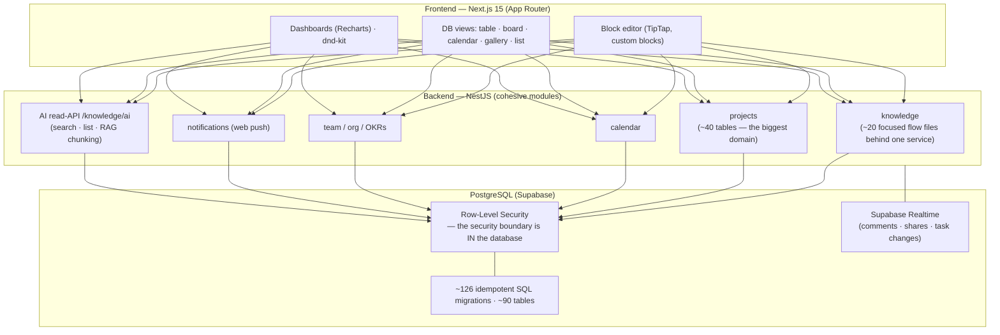
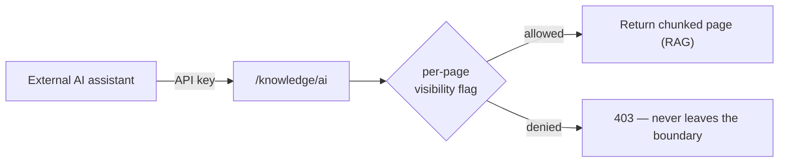

# Architecture

A full-stack work & knowledge platform: a block-editor wiki, Notion-style
databases-inside-documents, a project manager, and an AI layer wired through all of
it. These diagrams render on GitHub; the product source is private.

## The domains

## The engineering worth pointing at

- **SQL-first with RLS as the security boundary.** No ORM. The database itself
  enforces who can see what, with dedicated RLS migrations per entity — so a leak
  in the app layer can't hand out data the database won't release. More work up
  front, much harder to bypass later.
- **Databases-inside-documents, the real thing.** Records with typed properties
  (text, number, date, select, relations…) rendered as table / board / calendar /
  gallery / list, each view keeping its own filters and sorting. This is the Notion
  feature people actually miss when they leave Notion.
- **A permission boundary an AI has to respect.** The AI read-API (`/knowledge/ai`)
  exposes search, listing, and page chunking for retrieval (RAG) — but gated
  per-page by a visibility flag and its own API keys. The interesting part isn't
  "we called an LLM"; it's "the app decides exactly what an external assistant is
  allowed to read, at the page level."

- **A versioned editor schema** so old revisions still open after the document
  format evolves, plus a unified soft-delete/trash across every entity type.

## Scale, honestly

~126 migrations · ~90 tables · seven-plus product domains (wiki, doc-databases,
projects, forms, OKRs, org/people, social feed, AI) · ~150 files across two apps.
Built and shipped by one person. The engine works end to end; the honest remaining
work was the last 20% of UX polish.

---

## What's public here / what stays private

This is a **case-study repository.** The production source is private. What's
public is the architecture and the reasoning; the application code and any data
stay private.
